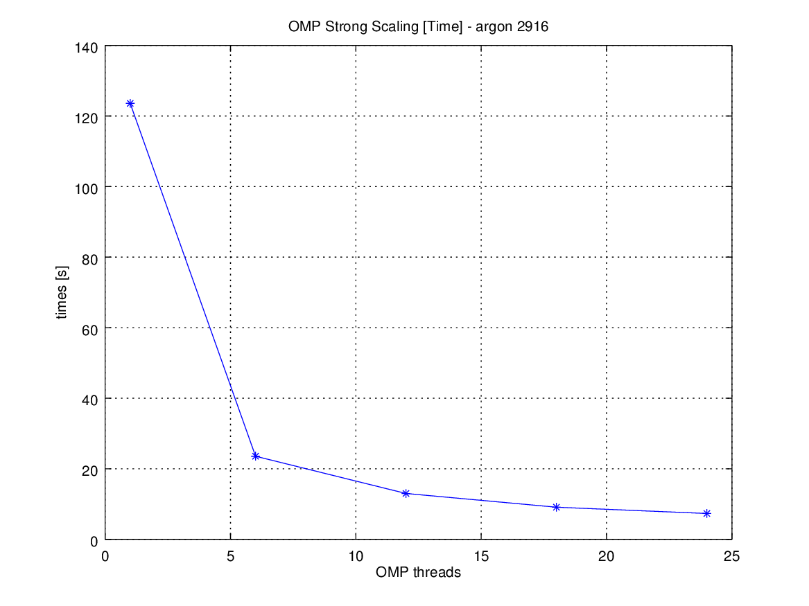
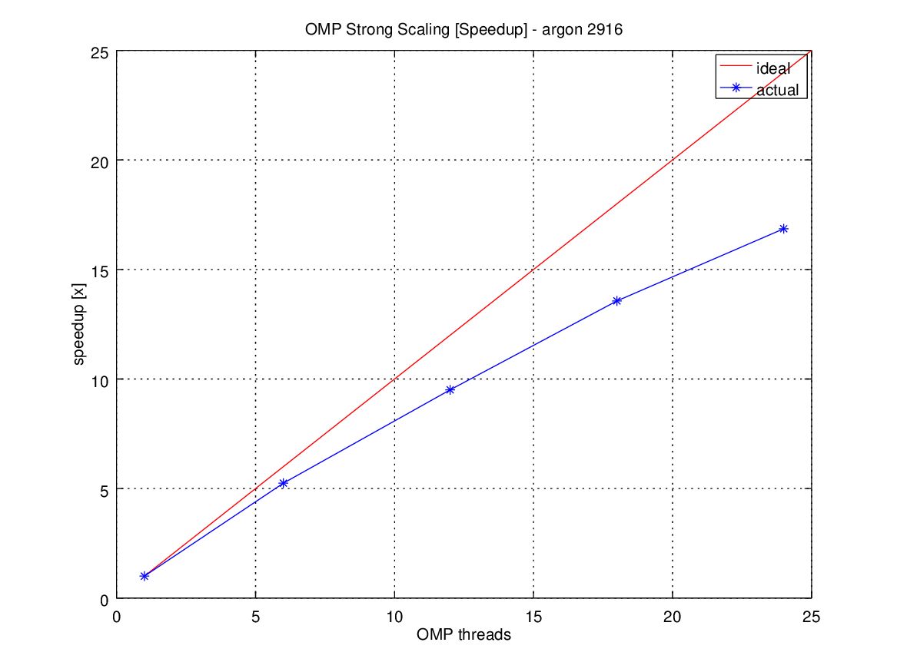

This package contains simplified MD code with multi-threading
parallelization for simulating atoms with a Lennard-Jones or Morse potential.

The examples directory contains 2 sets of example input decks
and the reference directory the corresponding outputs.

## How to use this repository

To compile the serial code: "make serial".
To compile the OpenMP-parallelized code: "make OMP".

To run the executable (ljmd-serial.x or ljmd-OMP.x): "../ljmd-ZZZ < <input_file>".
You can provide an integer "n" as optional argument "../ljmd-ZZZ.x <n> < <input_file>": this will select a different implementation of the force function according to the following list.

 n | force
---|---
 0 | force_Old, the original function
 1 | force_OpenMP, avoid costly math operations + OpenMP
 2 | force_Newton_3rd, avoid costly math operations + only compute once per pairs
 3 | force_Morse, use Morse potential instead of Lennard-Jones

all other values default to force_Newton_3rd

To compile and run all the unit tests: "make test_serial" or "make test_OMP".
See the makefile for more specific test targets.

## Serial optimization

Expensive operations such as powers, exponentials, or square roots have been moved outside of loops, or avoided altogether when possible.
In the force_Newton_3rd implementation of the force function, the force is computed for each pair of atoms instead (half as many times as in the original code).

# Profiling

The profiling was done with gprof on the cluster cosilt.

## OpenMP optimization 

